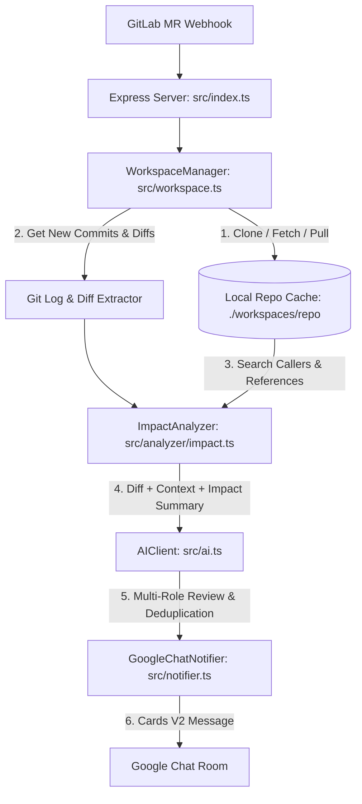

# Thiết Kế: Local Workspace & Impact Analysis Review Cho GitLab MR

## 1. Mục tiêu (Goals)
- Khi có sự kiện Merge Request (MR) trên GitLab, hệ thống tự động clone hoặc cập nhật mã nguồn của repository về thư mục làm việc cục bộ trên máy chủ VPS (`./workspaces/...`).
- Checkout chính xác nhánh MR (`source_branch`) và pull code mới nhất.
- Đọc các commit mới thay đổi, trích xuất diff và toàn bộ ngữ cảnh mã nguồn liên quan.
- Thực hiện phân tích phạm vi ảnh hưởng (Impact Analysis / Blast Radius): Tìm kiếm các hàm, class, interface hoặc module bị sửa đổi đang được gọi/import ở những vị trí nào trong toàn bộ dự án để phát hiện các lỗi phá vỡ tương thích (breaking changes) hoặc tác dụng phụ (side-effects).
- Thực hiện đánh giá chất lượng code qua AI Reviewer (Security, Bugs, Performance, Clean Code) kết hợp phân tích ảnh hưởng.
- Gửi báo cáo toàn diện (kèm Impact Analysis & commit log) về Google Chat qua định dạng Cards V2.

---

## 2. Kiến trúc & Các thành phần (Architecture & Components)

### 2.1. Quản lý Workspace (`src/workspace.ts`)
- **Đường dẫn lưu trữ:** `./workspaces/<project_id_or_slug>/`
- **Quản lý Git:**
  - Tạo URL clone có gắn `GITLAB_TOKEN`: `https://oauth2:${token}@${host}/${project_path}.git`
  - Nếu chưa có: `git clone <url> <target_dir>`
  - Nếu đã có: `git fetch origin --prune` -> `git checkout <source_branch>` -> `git pull origin <source_branch>`
- **Trích xuất thông tin MR từ Git:**
  - Lấy danh sách commit mới: `git log origin/<target_branch>..origin/<source_branch> --pretty=format:"%h - %s (%an)"`
  - Lấy git diff giữa target branch và source branch: `git diff origin/<target_branch>...origin/<source_branch>`

### 2.2. Phân tích ảnh hưởng (`src/analyzer/impact.ts`)
- **Phát hiện Symbol:** Quét các dòng code bị xoá/sửa trong diff để trích xuất danh sách tên hàm (`function xyz`, `const abc = ...`), class, interface, exported members hoặc endpoint URL.
- **Quét vị trí gọi (Usages / Callers Scan):**
  - Thực hiện quét trong toàn bộ thư mục repo cục bộ để xác định các file khác đang import hoặc gọi các symbol bị thay đổi.
  - Tổng hợp danh sách `impactedFiles` và `impactSummary` (ví dụ: *Hàm `calculateTotal` bị thay đổi tham số có 4 nơi gọi tại `src/orders/checkout.ts`, `src/services/billing.ts`...*).

### 2.3. AI Reviewer Prompt Nâng Cao (`src/ai.ts` & `src/roles/prompts.ts`)
- Bổ sung trường dữ liệu:
  - `newCommits`: Danh sách commit mới trong MR.
  - `impactAnalysis`: Kết quả quét ảnh hưởng từ `ImpactAnalyzer`.
- Cung cấp dữ liệu này vào prompt AI để AI thẩm định xem việc sửa đổi có làm hỏng các nơi gọi (caller sites) hay không.
- Schema JSON trả về bổ sung:
  - `impactAssessment`: Đánh giá mức độ ảnh hưởng của MR đến toàn hệ thống (Low/Medium/High).
  - `impactDetails`: Mô tả chi tiết các module/chức năng phụ thuộc cần test lại.

### 2.4. Google Chat Notifier (`src/notifier.ts`)
- Bổ sung section `💥 Phạm vi ảnh hưởng (Impact Analysis)` vào Cards V2:
  - Liệt kê các file/module bị ảnh hưởng gián tiếp.
  - Khuyến nghị các khu vực cần regression test.
- Hiển thị danh sách các commit mới nhất trong MR.

---

## 3. Xử lý lỗi & Độ ổn định (Error Handling & Robustness)
- **Token Security:** Đảm bảo không ghi đè token GitLab vào log console khi chạy lệnh `git clone`.
- **Concurrent Safety:** Khoá mutex hoặc quản lý queue theo repository để tránh 2 MR của cùng 1 repo checkout đè lên nhau cùng lúc.
- **Fallback:** Nếu việc clone/fetch git gặp sự cố (ví dụ lỗi mạng), hệ thống tự động fallback sang lấy diff từ GitLab API như hiện tại để không làm gián đoạn việc review.

---

## 4. Kế hoạch xác thực (Verification Plan)
- **Unit Test:**
  - Test `WorkspaceManager`: kiểm tra xử lý git clone / fetch / log parsing.
  - Test `ImpactAnalyzer`: kiểm tra khả năng trích xuất symbol và tìm kiếm nơi gọi trong thư mục test.
- **Integration Test:**
  - Mock webhook MR GitLab -> Kiểm tra quy trình checkout -> phân tích diff & impact -> kiểm tra payload gửi tới Google Chat.
